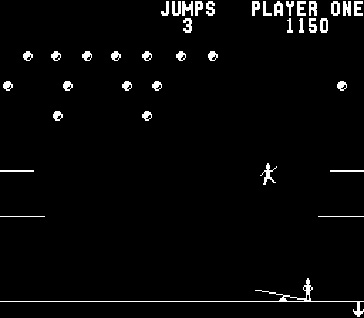
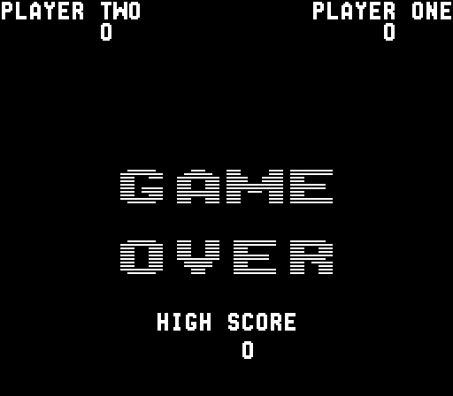

# Clowns — disassembly and C port

An **AI-assisted disassembly of Clowns** (Midway, 1978) and a complete, playable
**1:1 C port** of it — no emulation, no 8080 core at runtime; the original program
itself, translated one routine at a time. The reverse engineering and the port
were done together with an AI assistant (Anthropic's Claude). Every table is read
from the ROM image rather than retyped, and every behavioural question was settled
by running the ROM, not by guessing: the port is compared with the real ROM, byte
for byte, after every main-loop pass and every interrupt.

<p align="center">
  
  &nbsp;
  
  <br>
  <sub>The C port, <code>clowns_win.exe</code>.</sub>
</p>

Same layout as the
[Tempest](https://github.com/tcottrill/Tempest-Full-Disassembly-and-C-Port) and
[Space Duel](https://github.com/tcottrill/Space-Duel-Full-Disassembly-and-C-Port)
projects.

## What is here

| | |
|---|---|
| [`disasm/`](disasm/README.md) | The annotated disassembly of the program ROM (MAME `clowns`, rev. 2, `$0000-$17FF`): [`clowns_program_rom.asm`](disasm/clowns_program_rom.asm) — every byte, 207 named labels, 137 routine headers — and [`clowns_defines.asm`](disasm/clowns_defines.asm), with the generator that builds them from a ROM set and a verifier that re-encodes every line (6144 of 6144 bytes, 0 mismatches). [`sprites_preview.html`](disasm/sprites_preview.html) draws every bitmap in the ROM. |
| [`c_src/`](c_src/README.md) | The C port: one C function per routine of the listing, the machine's RAM and video RAM as raw arrays, a Windows build that plays (`clowns_win.exe`), and `tests\lockstep`, which runs the real ROM on an 8080 core beside the port: 16 scenarios, about 1.2 million compared events, 96 % of the ROM's instructions executed and verified. |
| `roms/` | Not included. Put your own MAME `clowns.zip` here. |

## Quick start

`c_src\clowns_win.exe` runs as it is. Keys: mouse or Left / Right for the seesaw,
**5** coin, **1** / **2** start, **F2** self-test switch, **F3** reset, **Esc** quit.
After power-on the ROM shows GAME OVER for about 16 seconds before its demo starts
and it accepts a coin.

To rebuild everything from a ROM set (Python 3 and Visual Studio 2022):

```bat
cd disasm
python gen_from_roms.py

cd ..\c_src
python tools\gen_state.py
python tools\gen_roms.py
build_win.bat
```

To run the verification:

```bat
cd c_src
build_all.bat
run_tests.bat
```

## The game, as the ROM plays it

Three rows of twelve balloons drift across the top (20, 50 and 100 points, bottom to
top). A clown walks out on one of four ledges and jumps; the player moves the seesaw
so that the clown lands on its raised end, which launches the clown standing on the
other end — straight up from the middle of the landing zone, sideways from its
edges, faster as the game goes on. A clown that hits the floor, or the wrong part
of the seesaw, costs a jump. Clearing a row (or all three, by switch) pays a bonus
and refills it; a switch-selected score gives an extra jump, another a bonus game.

Inside, the program is a small script interpreter in the foreground — attract mode,
coin handling and every jump are sequenced by 17 script commands — while two
interrupts per frame do all the drawing of the moving objects through the board's
MB14241 shifter. [`disasm/README.md`](disasm/README.md) has the overview.

## Limits

- The tone generator's pitch is exact; the balloon pops, the springboard hit and the
  miss sound are approximations by ear, not models of the discrete circuits.
- The port takes interrupts between main-loop passes, never in the middle of one.
- Black and white, as the board; no colour overlay.

Details in [`c_src/README.md`](c_src/README.md).

## Credits

- **Clowns**: Midway Mfg. Co., 1978. No ROMs are distributed here.
- Hardware facts (memory map, ports, switches, interrupts, the MB14241 shifter, the
  tone generator): the MAME driver `mw8080bw.cpp` / `mw8080bw_a.cpp`.
- The 8080 core used by the test oracle: Mike Chambers' Intel 8080 emulator (public
  domain), as converted for the [AAE emulator](https://github.com/tcottrill/AAE).
- Listing format and port structure: the Tempest and Space Duel projects.
